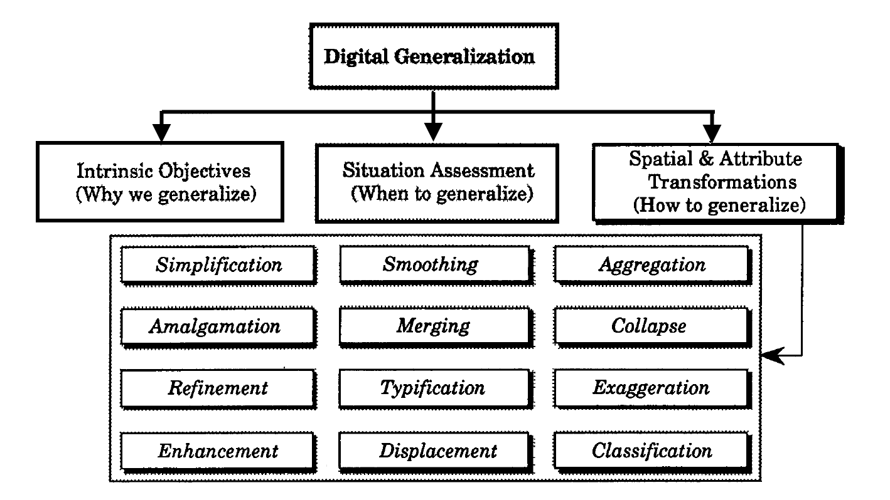
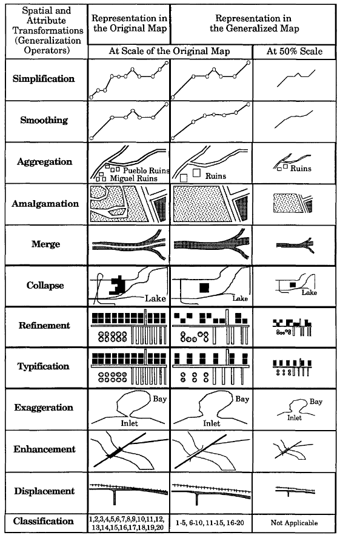

=== Generalization Techniques

Generalization in GIS is used to reduce the detail in data. With this reduction in detail, also the amount of data can be reduced, thus improving the usage in low bandwidth environments. [1] lists the following twelve categories of operators for cartographic generalization:

[[generalization-operators]]
.Twelve categories of generalization operators. (source [1])

Examples for the twelve operators are shown in the following image:

[[generalization_examples]]
.Sample spatial and attribute transformations of cartographic generalization. (source [1])

There are three types of geometry for that generalization techniques will be investigated in this ER: point, line and polygon. Several techniques can be applied to each of the geometry types. We chose to investigate the following operations further:

 * Aggregation/Merging: A digitized representation of a map feature should be accurate in its
representation of the feature (shape, location, and character), yet also efficient in
terms of retaining the least number of data points necessary to represent the
character. A profligate density of coordinates captured in the digitization stage
should be reduced by selecting a subset of the original coordinate pairs, while
retaining those points considered to be most representative of the line (Jenks, 1981).
Glitches should also be removed. Simplification operators will select the
characteristic, or shape-describing, points to retain, or will reject the redundant point
considered to be unnecessary to display the line's character. Simplification operators
produce a reduction in the number of derived data points which are unchanged in
their x,y coordinate positions. Some practical considerations of simplification
includes reduced plotting time, increased line crispness due to higher plotting
speeds, reduced storage, less problems in attaining plotter resolution due to scale
change, and quicker vector to raster conversion (see [2]).

 * Simplification: There are many instances when the number or density of like point
features within a region prohibits each from being portrayed and symbolized
individually within the graphic. This notwithstanding, from the perspective of the
map's purpose, the importance of those features requires that they still be portrayed.
To accomplish that goal, the point features must be aggregated into a higher order
class feature areas and symbolized as such. For example, if the intervening spaces
between houses are smaller than the physical extent of the buildings themselves, the
buildings can be aggregated and resymbolized as built-up areas (see [3]).

 * Refinement/Elimination: In many cases, where like features are either too numerous or too small to show to scale, no attempt should be made to show all the features. Instead, a selective number and pattern of the symbols are depicted. Generally, this is accomplished by leaving out the smallest features, or those which add little to the general impression of the distribution. Though the overall initial features are thinned out, the general pattern of the features is maintained with those features that are chosen by showing them in their correct locations. Excellent examples of this can be found in [4]. This refinement process retains the general characteristics of the features at a greatly reduced complexity.

[1] Shea, S. K., and McMaster, R. B.: Cartographic generalization in a digital environment: When and how to generalize, Proceedings of AutoCarto, Vol. 9. (1989)

[2] McMaster, R. B.: Automated Line Generalization,
Cartographica, 24(2), pp. 74-lll  (1987)

[3] Keates, J.S.: Cartographic Design and Production (1973)

[4] Swiss Society of Cartography: Cartographic Generalization,
Cartographic Publication Series, No. 2. (1977) English translation by Allan
Brown and Arie Kers, ITC Cartography Department, Enschede,
Netherlands)

