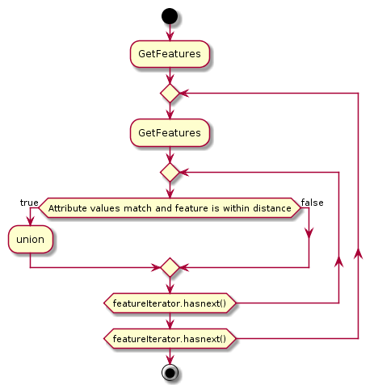

=== Merge Features by Attribute
The features are merged by attribute and optional additional by distance. If the specified attribute of two features is equal (and optionally if they fall in the specified distance), a union of the points is done and the resulting feature is added to the result set.
[[generalization_activity_image]]
.Activity diagram showing point generalization

== Inputs

=== distance
The distance of the features that should be considered for merging.
This should be a double value.

=== classfield
The attribute field that should be checked for equalness.
This should be a string value.

=== data
The features that should be generalized. The attribute chosen for the input _classfield_ must be present. The data-format should be zipped shapefile, optionally encoded in base64.

== Outputs

=== result

The generalized features. The data-format should be zipped shapefile, optionally encoded in base64.